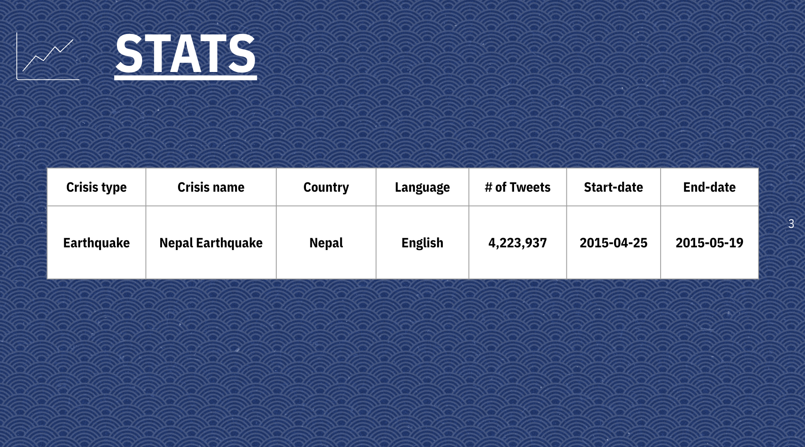
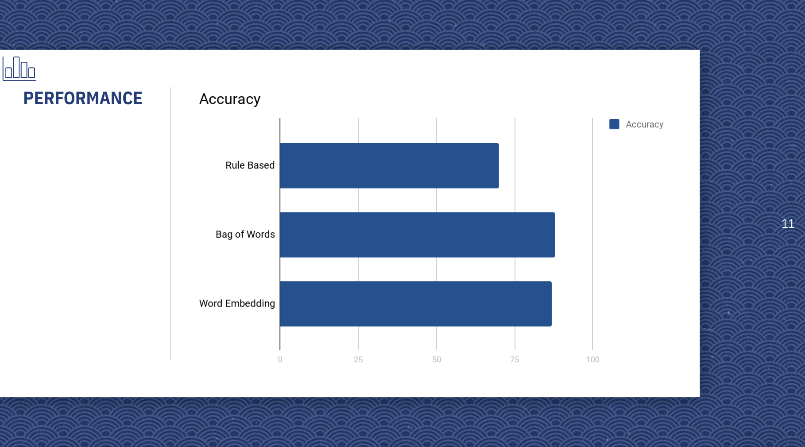

# Inspirit-AI-ClassifyingTweets
The aim of the project was to classify tweets sent relating to various natural disasters into categories depending on what type of aid is needed.

<h3>Some of the challenges we faced were:</h3>
Language and the way people speak it is constantly changing hence the tone and therefore sarcasm cannot be detected.

<h3>The Different Models We Used</h3>
 <ol>
  <li>Rule Based Classification </li>
  <li>Bag of Words</li>
  <li>Word Embedding</li>
</ol>

<h3>Performance Accuracy of each models</h3>

<h3>This graph below shows the results we predicted against the actual results for word embedding</h3>

